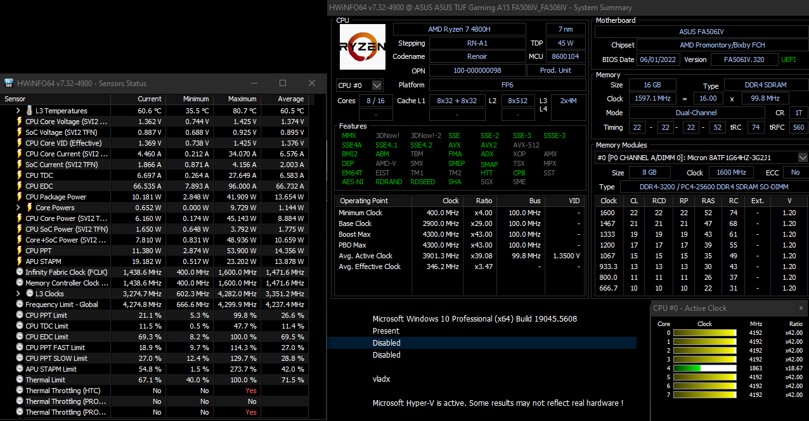

# Algoritmi de sortare - Structuri de Date

## **Temă de laborator**
- Universitatea din București
- Facultatea de Matematică și Informatică
- Licență ~ Informatică IF
- Structuri de Date ~ Semestrul II
- Acest proiect a fost realizat de [Minciunescu Vlad - 151](https://github.com/vlaxcs/), [Ghiță Radu-Ioachim - 152](https://github.com/KoNickss), [Pascariu Carlo-Alexandru - 152](https://github.com/alexandrucarlo)

## 1. Teste utilizate

Testele au fost generate automat, folosind [acest program Python](./cmake-build-debug/Generator/gen.py).

- #### Tipul de date INT
  - [x] Secvență de 1.000 de 1 și 0.
  - [x] Secvență de 4.000.000 de 1 și 0, pe poziții aleatorii.
  - [ ] Secvență de 4.000.000 de 1 și 0, pe poziții aleatorii distribuite 'Gauss'.
  - [x] Secvență de 4.000.000 de 1 și 0, ordonate în sens crescător.
  - [x] Secvență de 4.000.000 de 1 și 0, ordonate în sens descrescător.
  - [x] 1.000 de numere din [0, 10^5], naturale pe int, distribuite aleatoriu.
  - [x] 1.000 de numere din [0, 10^9 ~ 2,147,483,647 / INT_MAX], naturale pe int, distribuite aleatoriu.
  - [x] 1.000.000 de numere din [0, 10^9 ~ 2,147,483,647 / INT_MAX], naturale pe int, distribuite aleatoriu.
  - [x] 4.000.000 de numere din [0, 10^9 ~ 2,147,483,647 / INT_MAX], naturale pe int, distribuite aleatoriu.
  - [ ] Numere din [0, 10^9 ~ 2,147,483,647 / INT_MAX], naturale pe int, distribuite în prima jumătate de la [0, 10^4], apoi [10^4, 10^9].
  - [ ] Numere din [0, 10^9 ~ 2,147,483,647 / INT_MAX], naturale pe int, distribuite în prima jumătate de la [0, 10^4], apoi [10^4, 10^9].

- #### Tipul de date ULL (Unsigned Long Long)
  - Toate cele de mai sus.
  - [x] 1.000 de numere din [1, 10^19 ~ 18,446,744,073,709,551,615 / ULLONG_MAX], naturale pe unsigned long long.
  - [x] 100.000 de numere din [1, 10^19 ~ 18,446,744,073,709,551,615 / ULLONG_MAX], naturale pe unsigned long long.
  - [x] 1.000.000 de numere din [1, 10^19 ~ 18,446,744,073,709,551,615 / ULLONG_MAX], naturale pe unsigned long long.
  - [x] 4.000.000 de numere din [1, 10^19 ~ 18,446,744,073,709,551,615 / ULLONG_MAX], naturale pe unsigned long long.

- #### Tipul de date FLOAT
  - Toate cele de mai sus.
  - [x] 1.000 de numere din [-10^3, 10^3], reale pe float din float.h.
  - [x] 100.000 de numere din din [-10^3, 10^3], reale pe float din float.h.
  - [x] 500.000 de numere din [-10^6, 10^6], reale pe float, distribuite aleatoriu.
  - [x] 4.000.000 de numere din [1, 10^43 ~ 3.40282e+38 / FLT_MAX], reale pe float, distribuite aleatoriu.

```
test = [
    # INT
    {"count": 1_000, "lower": 0, "upper": 1},
    {"count": 4_000_000, "lower": 0, "upper": 1},
    {"count": 4_000_000, "lower": 0, "upper": 1, "order": "asc"},
    {"count": 4_000_000, "lower": 0, "upper": 1, "order": "desc"},
    {"count": 1_000, "lower": 0, "upper": 10_000},
    {"count": 1_000, "lower": 0, "upper": 2_147_483_647},
    {"count": 1_000_000, "lower": 0, "upper": 2_147_483_647},
    {"count": 4_000_000, "lower": 0, "upper": 2_147_483_647},
    # ULL
    {"count": 1_000, "lower": 0, "upper": 18_446_744_073_709_551_615},
    {"count": 100_000, "lower": 0, "upper": 18_446_744_073_709_551_615},
    {"count": 1_000_000, "lower": 0, "upper": 18_446_744_073_709_551_615},
    {"count": 4_000_000, "lower": 0, "upper": 18_446_744_073_709_551_615},
    # FLOAT
    {"count": 1_000, "lower": -1_000, "upper": 1_000},
    {"count": 100_000, "lower": -1_000, "upper": 1_000},
    {"count": 500_000, "lower": -100_000, "upper": 100_000},
    {"count": 4_000_000, "lower": 0, "upper": 340_282_000_000_000_000_000_000_000_000_000_000}
]
```

## 2. Configurație de testare

```
CPU: AMD Ryzen 7 4800H
Cores: 8
Threads: 16
TDP: 45 W
Base clock: 2.9 GHz -> Boost Max: 4.3 GHz
```

- Înainte de benchmark:
  - `Average active clock: 3.1 GHz ~ 1.1 V`

- În timpul benchmark-ului:
  - În timpul sortărilor pe INT:
    - `Average active clock: 3.1 GHz ~ 1.1V`
    - `Average effective clock: 1000 MHz`

  - În timpul sortărilor pe ULL:
    - `Average active clock: 3.5 GHz ~ 1.3V`
    - `Average effective clock: 1300 MHz`

  - În timpul sortărilor pe FLOAT:
    - `Average active clock: 3.7 GHz ~ 1.4V`
    - `Average effective clock: 1400 MHz`

Mai multe specificații:


## 3. Algoritmi de sortare analizați

- ### Merge Sort

- ### Shell Sort

- ### Radix Sort

- ### Heap Sort

- ### Tim Sort

- ### AVL Sort

- ### Default Sort (STL)

## 4. Concluzii

Rezultatele rulării programului se găsesc [aici](./cmake-build-debug/Results/stats.csv) și sunt generate după fiecare rulare, după ce fiecare algoritm trece toate testele care îi sunt impuse. Pentru fiecare test greșit, în zona respectivă din tabel va apărea valoarea 0.

Cu ajutorul acestor rezultate, am putut analiza în ce situații se comportă cel mai bine fiecare algoritm în parte, situații în care dă rateuri semnificative și diferențe între cum rulează fiecare, în funcție de tipul de date pe care operează.

Pentru analiză individuală, puteți prelua acest header în format CSV:

<code>
Nume sortare,Test 1,Test 2,Test 3,Test 4,Test 5,Test 6,Test 7,Test 8,Test 9,Test 10,Test 11,Test 12,Test 13,Test 14,Test 15,Test 16
</code>

[Analiză pe datele obținute](https://docs.google.com/spreadsheets/d/1XdGlZTay1lB6k2WAH3y66sNtS-324AQD3hbpKgi33Xw/edit?usp=sharing)

### Mențiuni
- Nu am putut împărți proiectul în sources/headers, deoarece am avut nevoie de template pentru fiecare algoritm în parte (acesta a fost util pentru a le putea testa pentru mai multe tipuri de date).

### Bibliografie:
[^1]: [Heapsort - Brilliant](https://brilliant.org/wiki/heap-sort/)
[^2]: [Heapsort - Programiz](https://www.programiz.com/dsa/heap-sort)
[^3]: [AVL Sort - MCGILL CS](https://www.cs.mcgill.ca/~jeromew/COMP251material/COMP251_Lecture4_W2017.pdf)
[^4]: [AVL Sort - MIT](https://ocw.mit.edu/courses/6-006-introduction-to-algorithms-fall-2011/83cdd705cd418d10d9769b741e34a2b8_MIT6_006F11_lec06.pdf)